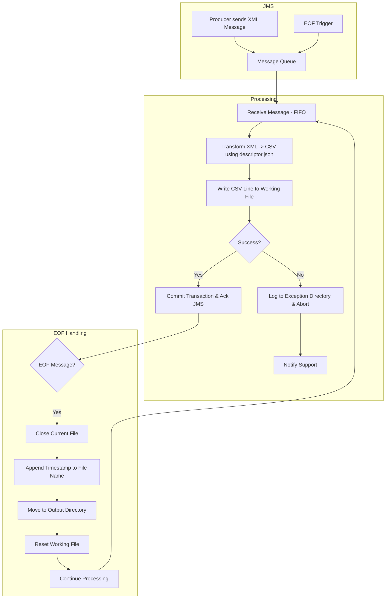
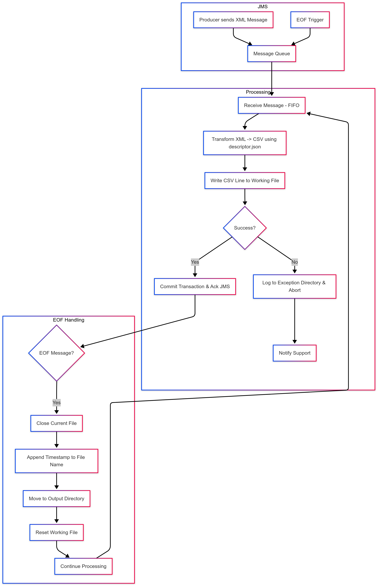

# XML to CSV Transformer via JMS Queue

## Overview
This document outlines the design requirements and flow for an XML-to-CSV Transformer system. The system consumes XML messages from a JMS queue, transforms them based on a descriptor, and writes them to a CSV file in a reliable, fault-tolerant, and transactional manner.

---

## Requirements

### 1. Message Production
- A producer continuously writes XML messages to a JMS queue.

### 2. Message Processing
- Messages are consumed in **FIFO order**.
- Each message undergoes the following transactional steps:
  - **Receiving**: The message is received from the JMS queue.
  - **Transformation**: The message is transformed from XML to CSV using rules defined in `descriptor.json`.
  - **Writing**: The resulting CSV line is appended to a file in the **Working directory**, using the file name specified in the descriptor.
  - **Error Handling**:
    - If an exception occurs in any step:
      - The message and exception details are logged in the **Exception directory**.
      - Processing is aborted.
      - The support team is notified.

### 3. File Closure (EOF)
- A scheduled trigger sends a special **EOF message** to the JMS queue.

### 4. Post-EOF Processing
Upon receiving the EOF message, the system:
  - (a) Closes the current output file.
  - (b) Appends a **timestamp** to the file name, as defined in the descriptor.
  - (c) Moves the file from the **Working directory** to the **Output directory**.
  - (d) Resets the file in the Working directory.
  - (e) Resumes message processing from step 2.

---

## Design Notes

- **Transactional Integrity**:
  - The JMS message is acknowledged and removed only after all steps in (2) succeed.
  - Guarantees exactly-once processing: no message loss or duplication.

- **Crash Recovery and Fault Tolerance**:
  - The system persists its state after each successful transaction.
  - In the event of a crash or shutdown, the system:
    - Resumes from the last unprocessed message in the queue.
    - Continues writing to the current working file without duplication.
    - Skips messages that have already been fully processed and acknowledged.
  - Messages that fail during processing are never acknowledged and remain in the queue for reprocessing upon restart.
  - The system must maintain a **persistent state store** that captures the current processing context, including:
    - Last successfully processed message ID
    - Current working file status
    - Record counts for input and output
    - EOF message detection state
  - This state must be stored in a durable medium (e.g., local database, file system, or external store) to enable reliable recovery.

- **Monitoring and Validation**:
  - System must track:
    - Total messages received.
    - Total messages written to file.
  - The system must validate and confirm that the number of messages consumed and the number of messages written are exactly the same.
  - Raise alerts if the numbers don’t match, indicating potential data loss or duplication.

- **Auditing**:
  - Each processed message includes metadata such as timestamp, message ID, and transformation status.
  - All exceptions are recorded with a full stack trace and original XML content in the Exception directory.
  - A summary log of each processing session is created, including:
    - Number of messages processed
    - Number of failures
    - Output file name
    - Timeframe of the session

---

## Process Flow (TD)




---

## External Configuration - descriptor.json
Example:
```json
{
  "fields": ["fieldA", "fieldB", "fieldC"],
  "delimiter": ",",
  "outputFileName": "output.csv",
  "timestampFormat": "yyyyMMdd_HHmmss",
  "workingDirectory": "./working",
  "outputDirectory": "./output",
  "exceptionDirectory": "./exception",
  "jmsQueueName": "InputQueue"
}
```

---

## Summary
This system ensures:
- End-to-end transactional message processing
- Accurate, FIFO-based transformation
- Comprehensive fault tolerance through state persistence and restart logic
- Persistent state management to support crash recovery and resume operations
- High reliability with no message loss or duplication
- Full auditability via session logs and exception tracking
- Real-time monitoring of message integrity
- Validated message count consistency between queue consumption and file output

---

*End of Document*

